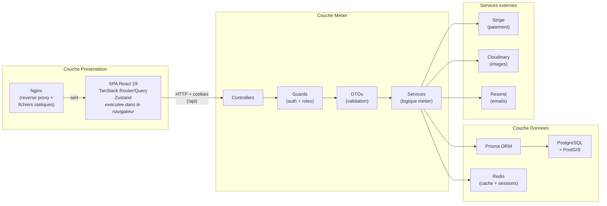

# Architecture globale - GreenRoots

> **Architecture 3 tiers** : la couche présentation (Nginx + SPA React) communique avec la couche métier (API REST NestJS) via des requêtes HTTP. La couche métier accède à la couche données (PostgreSQL, Redis) et aux services externes (Stripe, Cloudinary, Resend). Nginx sert les fichiers statiques de la SPA et redirige les appels `/api` vers NestJS.
