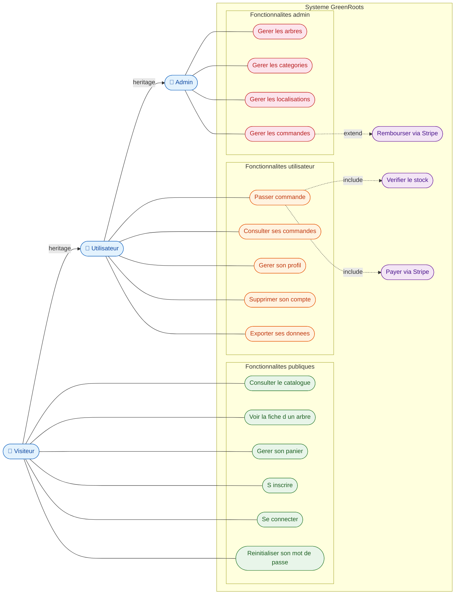

# Diagramme de cas d'utilisation - GreenRoots

```mermaid
graph LR
    classDef actor fill:#e3f2fd,stroke:#1565c0,color:#0d47a1
    classDef public fill:#e8f5e9,stroke:#2e7d32,color:#1b5e20
    classDef auth fill:#fff3e0,stroke:#e65100,color:#bf360c
    classDef admin fill:#fce4ec,stroke:#c62828,color:#b71c1c
    classDef include fill:#f3e5f5,stroke:#6a1b9a,color:#4a148c

    Visiteur(["👤 Visiteur"])
    Utilisateur(["👤 Utilisateur"])
    Admin(["👤 Admin"])

    Visiteur -->|heritage| Utilisateur
    Utilisateur -->|heritage| Admin

    subgraph GreenRoots["Systeme GreenRoots"]
        direction TB

        subgraph Public["Fonctionnalites publiques"]
            UC1([Consulter le catalogue])
            UC2([Voir la fiche d un arbre])
            UC3([Gerer son panier])
            UC4([S inscrire])
            UC5([Se connecter])
            UC6([Reinitialiser son mot de passe])
        end

        subgraph Authentifie["Fonctionnalites utilisateur"]
            UC7([Passer commande])
            UC8([Consulter ses commandes])
            UC9([Gerer son profil])
            UC10([Supprimer son compte])
            UC11([Exporter ses donnees])
        end

        subgraph Administration["Fonctionnalites admin"]
            UC12([Gerer les arbres])
            UC13([Gerer les categories])
            UC14([Gerer les localisations])
            UC15([Gerer les commandes])
        end

        UC16([Verifier le stock])
        UC17([Payer via Stripe])
        UC18([Rembourser via Stripe])
    end

    Visiteur --- UC1
    Visiteur --- UC2
    Visiteur --- UC3
    Visiteur --- UC4
    Visiteur --- UC5
    Visiteur --- UC6

    Utilisateur --- UC7
    Utilisateur --- UC8
    Utilisateur --- UC9
    Utilisateur --- UC10
    Utilisateur --- UC11

    Admin --- UC12
    Admin --- UC13
    Admin --- UC14
    Admin --- UC15

    UC7 -.->|"include"| UC16
    UC7 -.->|"include"| UC17
    UC15 -.->|"extend"| UC18

    class Visiteur,Utilisateur,Admin actor
    class UC1,UC2,UC3,UC4,UC5,UC6 public
    class UC7,UC8,UC9,UC10,UC11 auth
    class UC12,UC13,UC14,UC15 admin
    class UC16,UC17,UC18 include
```

> **Legende** : 🔵 Acteurs — 🟢 Fonctionnalites publiques — 🟠 Fonctionnalites utilisateur — 🔴 Fonctionnalites admin — 🟣 Include/Extend
