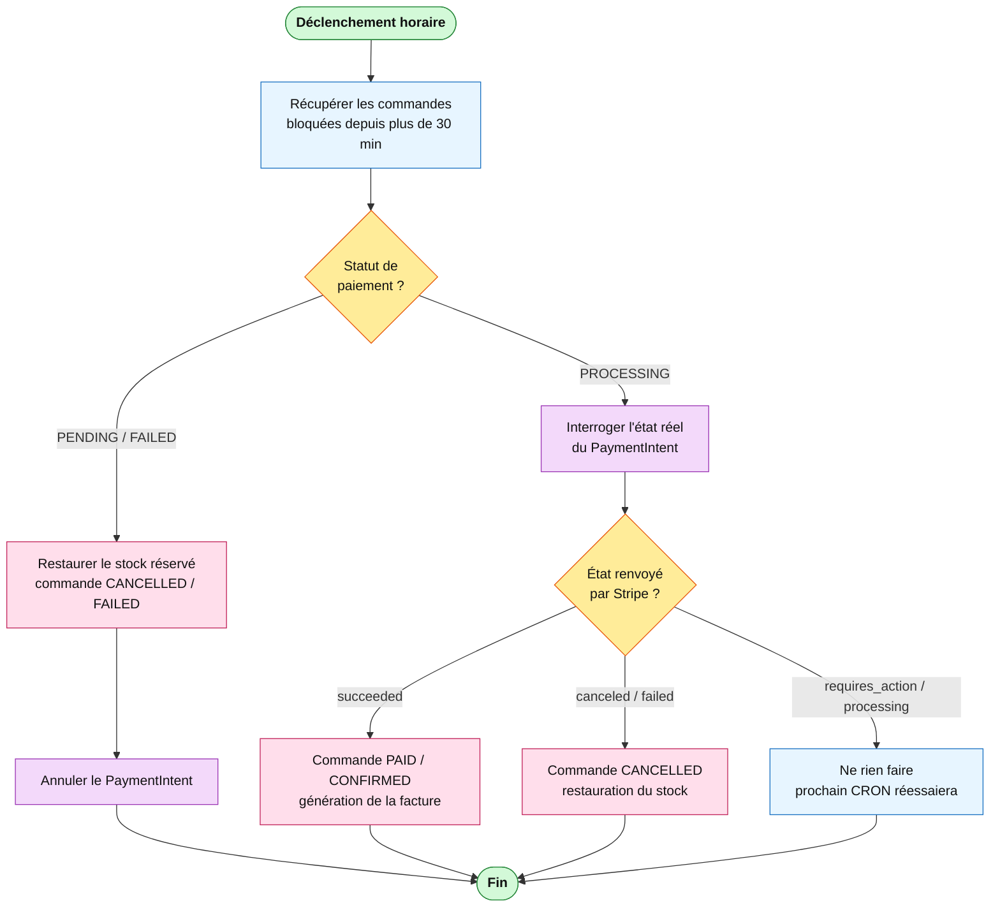

# Diagramme d'activité — Réconciliation des commandes (CRON)

> Processus **automatisé** `OrdersCleanupService`, déclenché toutes les heures (`@Cron(EVERY_HOUR)`).
> Filet de sécurité pour les commandes « zombies » restées incohérentes au-delà de 30 min.

## Version A — `flowchart` stylisé (recommandée pour un rendu propre)

> Code couleur = système responsable : 🔵 **CRON** · 🟣 **Stripe** · 🔴 **Base de données**.
> Losanges jaunes = décisions, stades verts = début/fin. Rendu fiable partout (mermaid.live, VS Code, GitHub).



## Version B — `swimlane-beta` (vrais couloirs, Mermaid natif)

> ⚠️ Beta (v11.16.0+) : exporter depuis **mermaid.live**. Libellés volontairement courts pour la lisibilité.

```
swimlane-beta TB
  subgraph CRON[CRON · horaire]
    S([Déclenchement])
    SCAN[Commandes bloquées > 30 min]
    D1{Statut paiement ?}
    D2{État Stripe ?}
    W[Attendre prochain CRON]
    E([Fin])
  end
  subgraph STRIPE[API Stripe]
    QP[Interroger PaymentIntent]
    CP[Annuler PaymentIntent]
  end
  subgraph BDD[Base de données]
    AB[Stock restauré + CANCELLED/FAILED]
    FIN[PAID/CONFIRMED + facture]
    CF[CANCELLED + stock restauré]
  end

  S --> SCAN --> D1
  D1 -->|PENDING / FAILED| AB --> CP --> E
  D1 -->|PROCESSING| QP --> D2
  D2 -->|succeeded| FIN --> E
  D2 -->|canceled / failed| CF --> E
  D2 -->|requires_action| W --> E
```

## Version C — PlantUML (UML activité authentique)

Voir `activite-reconciliation-cron.puml` (rendu sur planttext.com) : notation UML stricte,
vrais couloirs `|CRON| |Stripe| |BDD|`, start/stop.

---

**Lecture** : le CRON récupère les commandes bloquées puis branche selon le statut de paiement.
Abandonnées (PENDING/FAILED) → annulation + stock restauré. Bloquées en PROCESSING (webhook perdu)
→ interrogation directe de Stripe : réussi → on finalise (on ne perd pas une vente payée) ;
annulé/échoué → annulation + stock libéré ; en attente (3D Secure) → report au prochain passage.
