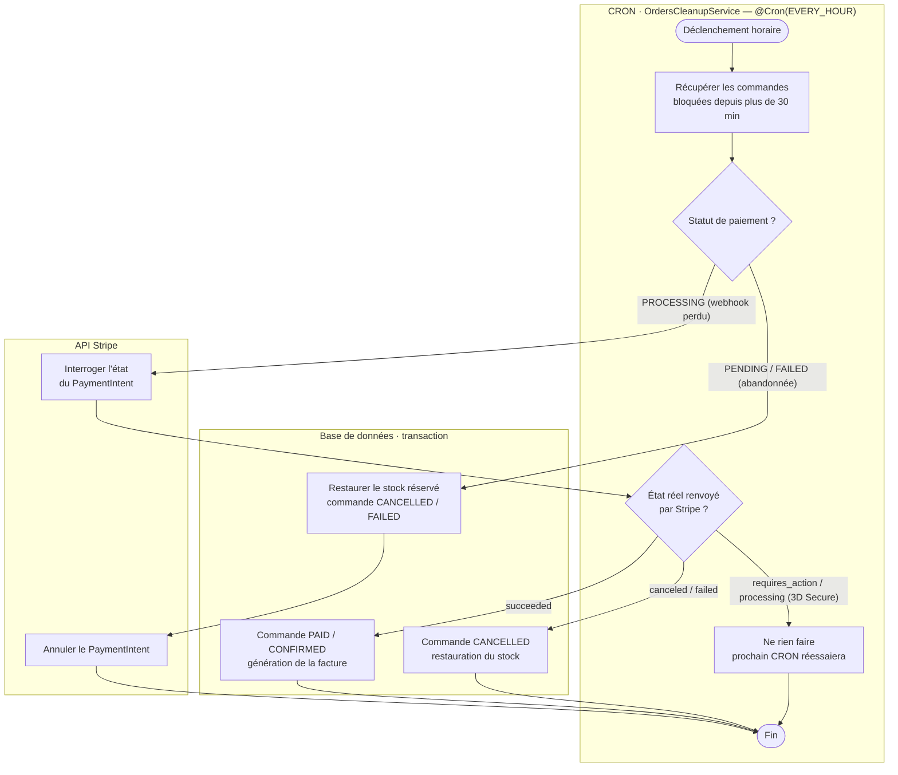

# Diagramme d'activité — Réconciliation des commandes (CRON)

> UML activité (rendu Mermaid `flowchart` + `subgraph` = couloirs). Processus **automatisé**
> `OrdersCleanupService`, déclenché toutes les heures (`@Cron(EVERY_HOUR)`). Filet de sécurité
> pour les commandes « zombies » restées incohérentes après 30 min.
> Couloirs : **CRON** (orchestration/décisions) · **API Stripe** · **Base de données**.

**Lecture** : le CRON récupère les commandes bloquées, puis branche selon le statut de paiement.
Les commandes *abandonnées* (PENDING/FAILED) sont annulées et leur stock restauré. Les commandes
*bloquées en PROCESSING* (webhook perdu) déclenchent une **interrogation directe de Stripe** :
paiement réussi → on finalise (évite de perdre une vente payée) ; annulé/échoué → on annule et
libère le stock ; en attente (3D Secure) → on laisse le prochain passage réessayer.
