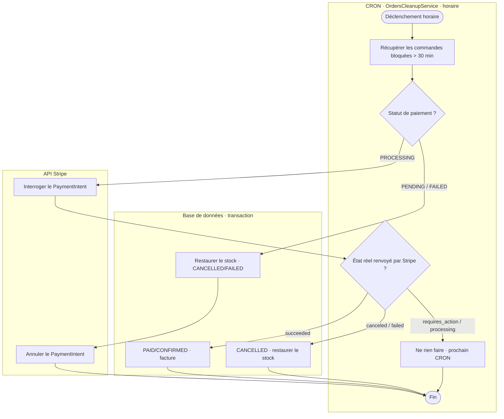

# Diagramme d'activité — Réconciliation des commandes (CRON)

> Processus **automatisé** `OrdersCleanupService`, déclenché toutes les heures (`@Cron(EVERY_HOUR)`).
> Filet de sécurité pour les commandes « zombies » restées incohérentes au-delà de 30 min.
> Couloirs : **CRON** (orchestration/décisions) · **API Stripe** · **Base de données**.

## Version 1 — Mermaid `swimlane-beta` (recommandée : vrais couloirs)

> ⚠️ Type **beta** (Mermaid v11.16.0+). Se rend sur **mermaid.live** (à jour). GitHub / anciens
> renderers peuvent ne pas encore le supporter → exporter l'image depuis mermaid.live pour le Word.

```
swimlane-beta TB
  subgraph CRON[CRON · OrdersCleanupService · horaire]
    start([Déclenchement horaire])
    scan[Récupérer les commandes bloquées depuis plus de 30 min]
    dtype{Statut de paiement ?}
    sdec{État réel renvoyé par Stripe ?}
    wait[Ne rien faire · prochain CRON réessaiera]
    stop([Fin])
  end
  subgraph STRIPE[API Stripe]
    queryPI[Interroger l'état du PaymentIntent]
    cancelPI[Annuler le PaymentIntent]
  end
  subgraph BDD[Base de données · transaction]
    abandon[Restaurer le stock réservé · commande CANCELLED/FAILED]
    finalize[Commande PAID/CONFIRMED · génération facture]
    cancelFree[Commande CANCELLED · restauration du stock]
  end

  start --> scan --> dtype
  dtype -->|PENDING / FAILED| abandon
  abandon --> cancelPI --> stop
  dtype -->|PROCESSING| queryPI
  queryPI --> sdec
  sdec -->|succeeded| finalize --> stop
  sdec -->|canceled / failed| cancelFree --> stop
  sdec -->|requires_action / processing| wait --> stop
```

## Version 2 — fallback `flowchart` (rendu partout, couloirs approximés)



## Version 3 — PlantUML (UML activité authentique)

Voir `activite-reconciliation-cron.puml` (rendu sur planttext.com) : notation UML stricte
(start/stop, losanges, vrais couloirs `|CRON| |Stripe| |BDD|`).

---

**Lecture** : le CRON récupère les commandes bloquées puis branche selon le statut de paiement.
Abandonnées (PENDING/FAILED) → annulation + stock restauré. Bloquées en PROCESSING (webhook perdu)
→ interrogation directe de Stripe : réussi → on finalise (on ne perd pas une vente payée) ;
annulé/échoué → annulation + stock libéré ; en attente (3D Secure) → report au prochain passage.
