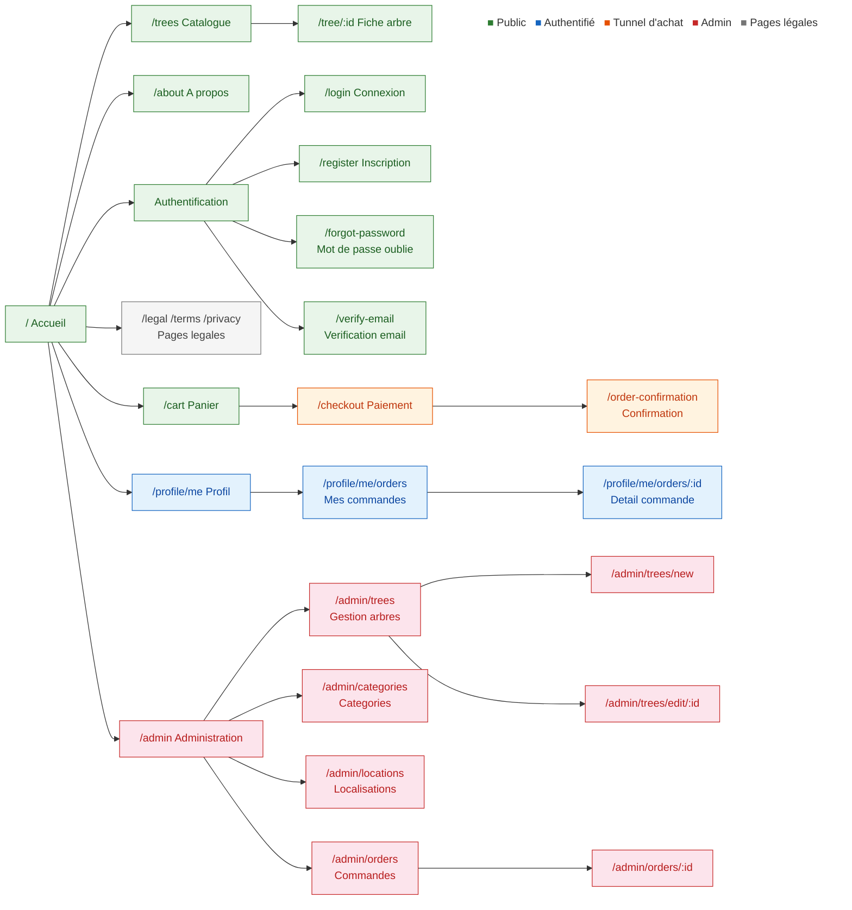

# Arborescence du site - GreenRoots

```mermaid
graph LR
    classDef public fill:#e8f5e9,stroke:#2e7d32,color:#1b5e20
    classDef auth fill:#e3f2fd,stroke:#1565c0,color:#0d47a1
    classDef admin fill:#fce4ec,stroke:#c62828,color:#b71c1c
    classDef checkout fill:#fff3e0,stroke:#e65100,color:#bf360c
    classDef legal fill:#f5f5f5,stroke:#757575,color:#424242

    Root["/ Accueil"]

    Root --> Trees["/trees Catalogue"]
    Trees --> TreeDetail["/tree/:id Fiche arbre"]

    Root --> About["/about A propos"]
    Root --> Cart["/cart Panier"]

    Root --> LegalGroup["/legal /terms /privacy<br/>Pages legales"]

    Root --> AuthGroup["Authentification"]
    AuthGroup --> Login["/login Connexion"]
    AuthGroup --> Register["/register Inscription"]
    AuthGroup --> ForgotPwd["/forgot-password<br/>Mot de passe oublie"]
    AuthGroup --> VerifyEmail["/verify-email<br/>Verification email"]

    Cart --> Checkout["/checkout Paiement"]
    Checkout --> OrderConfirm["/order-confirmation<br/>Confirmation"]

    Root --> Profile["/profile/me Profil"]
    Profile --> Orders["/profile/me/orders<br/>Mes commandes"]
    Orders --> OrderDetail["/profile/me/orders/:id<br/>Detail commande"]

    Root --> Admin["/admin Administration"]
    Admin --> AdminTrees["/admin/trees<br/>Gestion arbres"]
    AdminTrees --> AdminTreeNew["/admin/trees/new"]
    AdminTrees --> AdminTreeEdit["/admin/trees/edit/:id"]
    Admin --> AdminCategories["/admin/categories<br/>Categories"]
    Admin --> AdminLocations["/admin/locations<br/>Localisations"]
    Admin --> AdminOrders["/admin/orders<br/>Commandes"]
    AdminOrders --> AdminOrderDetail["/admin/orders/:id"]

    class Root,Trees,TreeDetail,About,Cart public
    class LegalGroup legal
    class AuthGroup,Login,Register,ForgotPwd,VerifyEmail public
    class Checkout,OrderConfirm checkout
    class Profile,Orders,OrderDetail auth
    class Admin,AdminTrees,AdminTreeNew,AdminTreeEdit,AdminCategories,AdminLocations,AdminOrders,AdminOrderDetail admin

    Legende["<span style='white-space:nowrap'><span style='color:#2e7d32'>■</span> Public &nbsp; <span style='color:#1565c0'>■</span> Authentifié &nbsp; <span style='color:#e65100'>■</span> Tunnel d'achat &nbsp; <span style='color:#c62828'>■</span> Admin &nbsp; <span style='color:#757575'>■</span> Pages légales</span>"]
    style Legende fill:none,stroke:none
    TreeDetail ~~~ Legende
```
