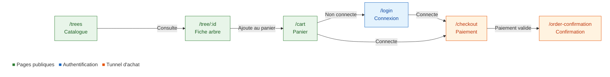

# Corps — Enchaînement des écrans : Parcours d'achat · GreenRoots

```mermaid
flowchart LR
    classDef public fill:#e8f5e9,stroke:#2e7d32,color:#1b5e20
    classDef auth fill:#e3f2fd,stroke:#1565c0,color:#0d47a1
    classDef checkout fill:#fff3e0,stroke:#e65100,color:#bf360c

    Catalogue["/trees<br/>Catalogue"]
    Fiche["/tree/:id<br/>Fiche arbre"]
    Panier["/cart<br/>Panier"]
    Login["/login<br/>Connexion"]
    Checkout["/checkout<br/>Paiement"]
    Confirmation["/order-confirmation<br/>Confirmation"]

    Catalogue -->|"Consulte"| Fiche
    Fiche -->|"Ajoute au panier"| Panier
    Panier -->|"Non connecte"| Login
    Login -->|"Connecte"| Checkout
    Panier -->|"Connecte"| Checkout
    Checkout -->|"Paiement valide"| Confirmation

    class Catalogue,Fiche,Panier public
    class Login auth
    class Checkout,Confirmation checkout

    Legende["<span style='white-space:nowrap'><span style='color:#2e7d32'>■</span> Pages publiques &nbsp; <span style='color:#1565c0'>■</span> Authentification &nbsp; <span style='color:#e65100'>■</span> Tunnel d'achat</span>"]
    style Legende fill:none,stroke:none
```
