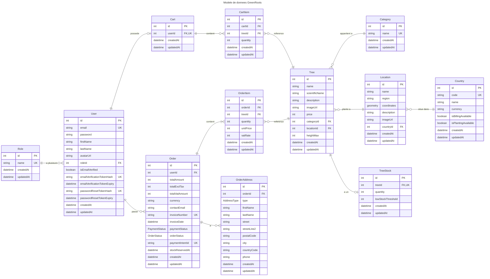

# ERD - Modele de donnees GreenRoots

```mermaid
---
title: Modele de donnees GreenRoots
---
erDiagram
    direction LR

    Role ||--o{ User : "a plusieurs"
    User ||--o| Cart : "possede"
    User ||--o{ Order : "passe"
    Cart ||--o{ CartItem : "contient"
    CartItem }o--|| Tree : "reference"
    Order ||--|{ OrderItem : "contient"
    Order ||--o{ OrderAddress : "a"
    OrderItem }o--|| Tree : "reference"
    Tree }o--|| Category : "appartient a"
    Tree }o--|| Location : "plante a"
    Tree ||--o| TreeStock : "a un"
    Location }o--|| Country : "situe dans"

    Role {
        int id PK
        string name UK
        datetime createdAt
        datetime updatedAt
    }

    User {
        int id PK
        string email UK
        string password
        string firstName
        string lastName
        string avatarUrl
        int roleId FK
        boolean isEmailVerified
        string emailVerificationTokenHash UK
        datetime emailVerificationTokenExpiry
        string passwordResetTokenHash UK
        datetime passwordResetTokenExpiry
        datetime createdAt
        datetime updatedAt
    }

    Tree {
        int id PK
        string name
        string scientificName
        string description
        string imageUrl
        int price
        int categoryId FK
        int locationId FK
        int heightMax
        datetime createdAt
        datetime updatedAt
    }

    TreeStock {
        int id PK
        int treeId FK,UK
        int quantity
        int lowStockThreshold
        datetime createdAt
        datetime updatedAt
    }

    Category {
        int id PK
        string name UK
        datetime createdAt
        datetime updatedAt
    }

    Location {
        int id PK
        string name
        string region
        geometry coordinates
        string description
        string imageUrl
        int countryId FK
        datetime createdAt
        datetime updatedAt
    }

    Country {
        int id PK
        string code UK
        string name
        string currency
        boolean isBillingAvailable
        boolean isPlantingAvailable
        datetime createdAt
        datetime updatedAt
    }

    Order {
        int id PK
        int userId FK
        int totalAmount
        int totalExclTax
        int totalVatAmount
        string currency
        string contactEmail
        string invoiceNumber UK
        datetime invoiceDate
        PaymentStatus paymentStatus
        OrderStatus orderStatus
        string paymentIntentId UK
        datetime stockReservedAt
        datetime createdAt
        datetime updatedAt
    }

    OrderItem {
        int id PK
        int orderId FK
        int treeId FK
        int quantity
        int unitPrice
        int vatRate
        datetime createdAt
        datetime updatedAt
    }

    OrderAddress {
        int id PK
        int orderId FK
        AddressType type
        string firstName
        string lastName
        string street
        string streetLine2
        string postalCode
        string city
        string countryCode
        string phone
        datetime createdAt
        datetime updatedAt
    }

    Cart {
        int id PK
        int userId FK,UK
        datetime createdAt
        datetime updatedAt
    }

    CartItem {
        int id PK
        int cartId FK
        int treeId FK
        int quantity
        datetime createdAt
        datetime updatedAt
    }
```
