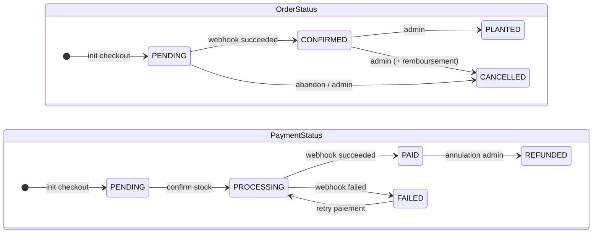

# Diagramme d'états — Cycle de vie d'une commande

> **Points clés** : Les deux machines évoluent en parallèle — le webhook Stripe pilote PaymentStatus, qui déclenche la transition OrderStatus. Les transitions autorisées sont définies dans la constante `ORDER_STATUS_TRANSITIONS` du code. L'annulation d'une commande payée déclenche un remboursement Stripe + restauration du stock.
