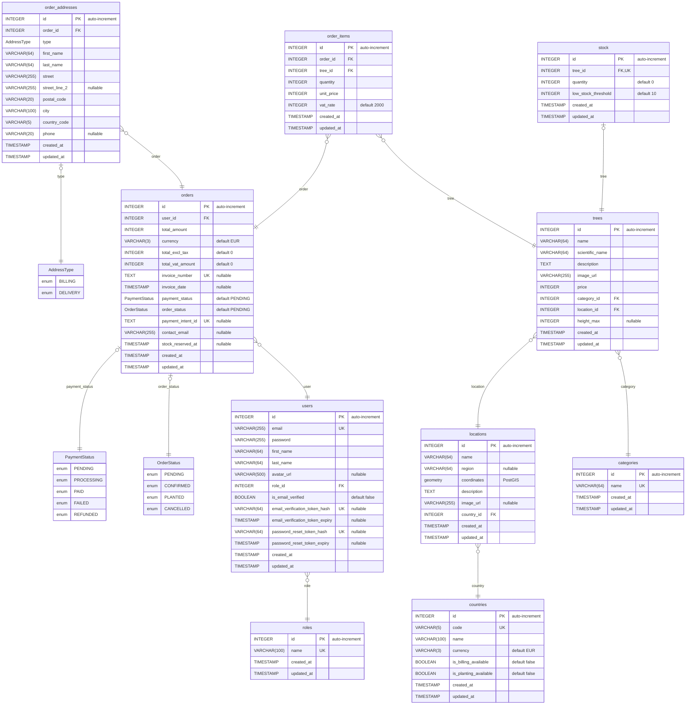

# MPD — Modèle Physique de Données (GreenRoots)

> Niveau **physique** (PostgreSQL). Représentation de ce que définit `schema.prisma`.
> **Colonne clé** : `PK` (primaire), `FK` (étrangère), `UK` (unicité). Commentaires : type
> nullable / valeur par défaut. Types = types PostgreSQL réels (VARCHAR(n), TEXT, INTEGER,
> TIMESTAMP, BOOLEAN, geometry, types énumérés).
>
> ⚠️ Le diagramme ne peut pas tout exprimer (unicités composites, `ON DELETE`, index,
> séquences) → voir la section **« Contraintes physiques complémentaires »** dessous.
> Le MPD **autoritaire et complet** reste le DDL des migrations : `prisma/migrations/*/migration.sql`.

## Contraintes physiques complémentaires (non représentables dans le diagramme)

- **Clés primaires** : `id` en auto-increment (séquence PostgreSQL) sur les 10 tables.
- **Unicités composites** :
  - `trees (name, location_id)` — un même arbre unique par lieu (`unique_tree_per_location`)
  - `order_items (order_id, tree_id)` — une ligne par arbre et par commande
  - `order_addresses (order_id, type)` — au plus une adresse par type et par commande
- **Actions référentielles (`ON DELETE`)** :
  - `stock.tree_id` → `trees(id)` **CASCADE** (le stock disparaît avec l'arbre)
  - `order_addresses.order_id` → `orders(id)` **CASCADE**
  - autres FK : `RESTRICT` (défaut — on ne supprime pas un référentiel utilisé)
- **Types énumérés PostgreSQL** (`CREATE TYPE`) : `payment_status`, `order_status`, `address_type`.
- **Extension** : **PostGIS** requise pour `locations.coordinates` (`geometry`).
- **Index** : implicites sur chaque PK et chaque contrainte `UNIQUE` ; index sur FK selon les besoins de requêtage.
- **Défauts** : `currency = 'EUR'`, `total_excl_tax = 0`, `total_vat_amount = 0`, `quantity = 0`,
  `low_stock_threshold = 10`, `vat_rate = 2000` (20,00 %), booléens `= false`, statuts `= PENDING`.

> **Source de vérité** : les fichiers `prisma/migrations/*/migration.sql` (≈20 migrations) contiennent
> le DDL PostgreSQL réel (CREATE TABLE, types, contraintes, index). Cet ERD en est la synthèse visuelle.
