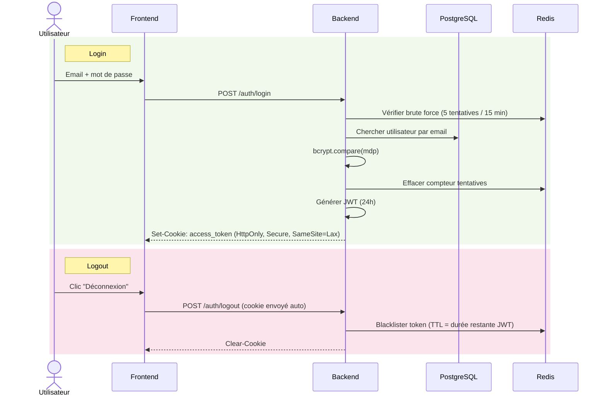

# Diagramme de séquence — Authentification

> **Points clés** : Redis joue un double rôle — protection brute force (compteur INCR avec TTL auto-expirant) et blacklist des tokens révoqués au logout. Le cookie HttpOnly protège contre le vol de token par XSS. Le rôle est vérifié en BDD à chaque requête authentifiée (pas depuis le token).
