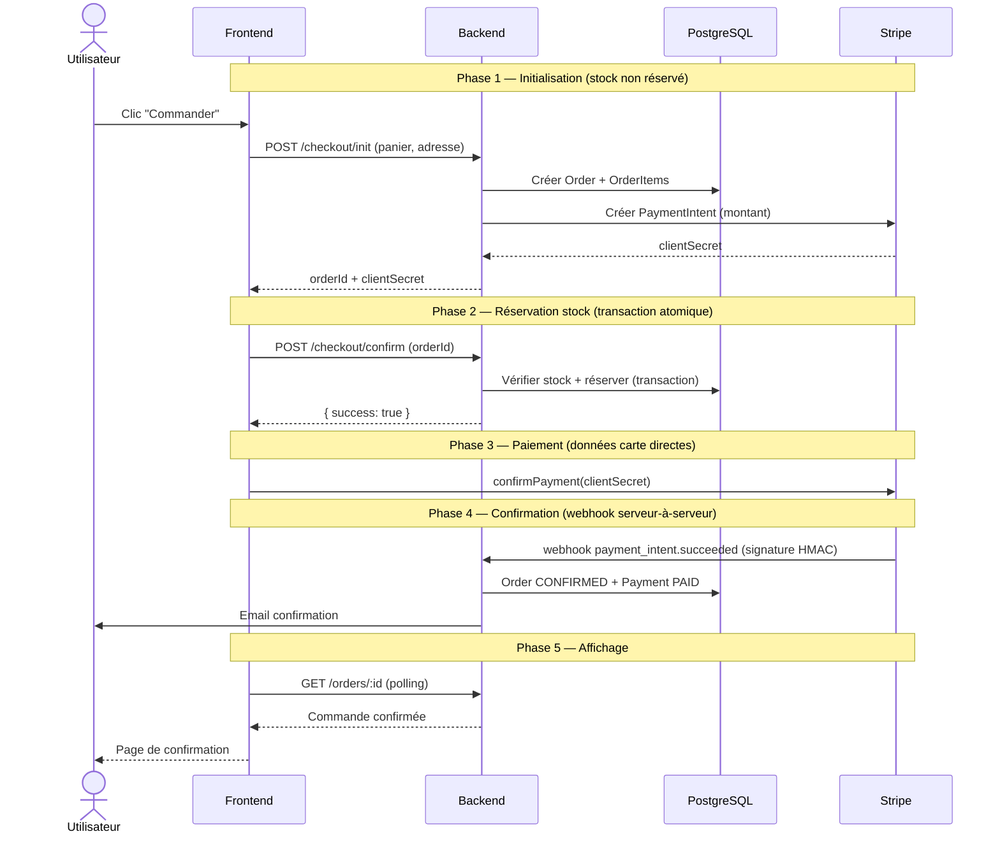

# Diagramme de séquence — Processus de commande

> **Points clés** : Le stock n'est réservé qu'au moment du confirm (phase 2), pas à l'initialisation — cela minimise le blocage de stock. Le webhook Stripe (phase 4) est la source de vérité pour confirmer le paiement. Les données bancaires ne transitent jamais par le backend.
